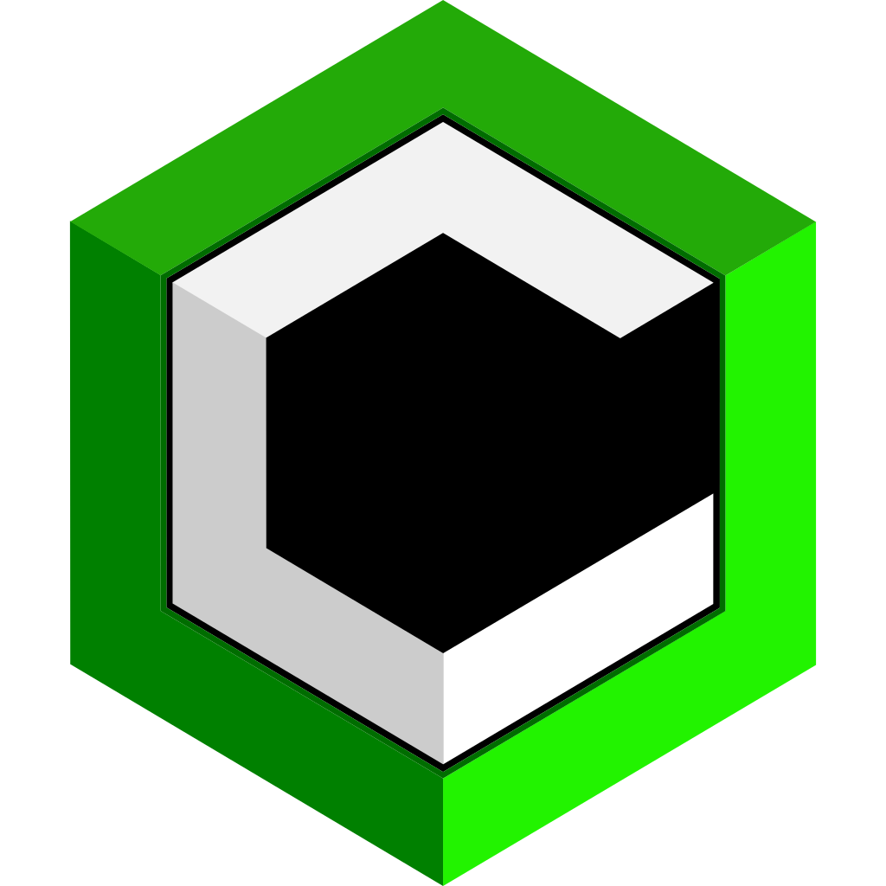

#  Cubyx Website
## Version V3 - SvelteKit

[Platzhalter Text]

### Entwicklung

Um an der Website zu arbeiten, muss diese zunächst geklont werden. Nutze dazu entweder die GitHub Desktop App (oder ähnliche Anwendung) oder führe folgenden Befehl in der Konsole aus:

```bash
git clone https://github.com/Cubyx-Network/website.git
```

oder mit SSH:

```bash
git clone git@github.com/Cubyx-Network/website.git
```

Anschließend müssen die Dependencies mit `npm install` installiert werden.

```bash
npm install
```

### Ausführen

Um die Website lokal zu testen, führe folgenden Befehl aus:

```bash
npm run dev
```

### Bauen

Um die Website zu bauen, führe folgenden Befehl aus:

```bash
npm run build
```

Die fertige Website befindet sich anschließend im `build` Ordner.
